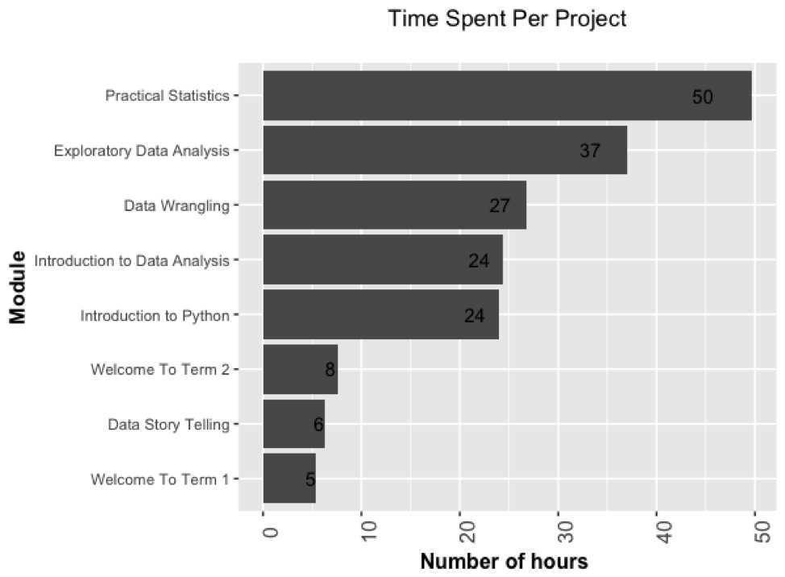
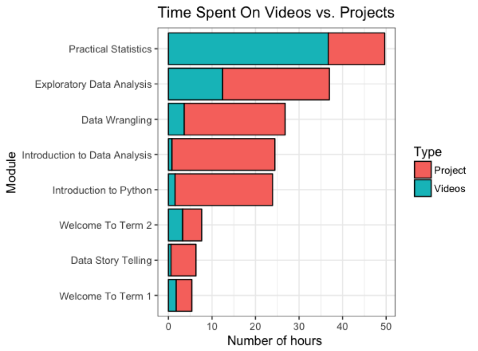
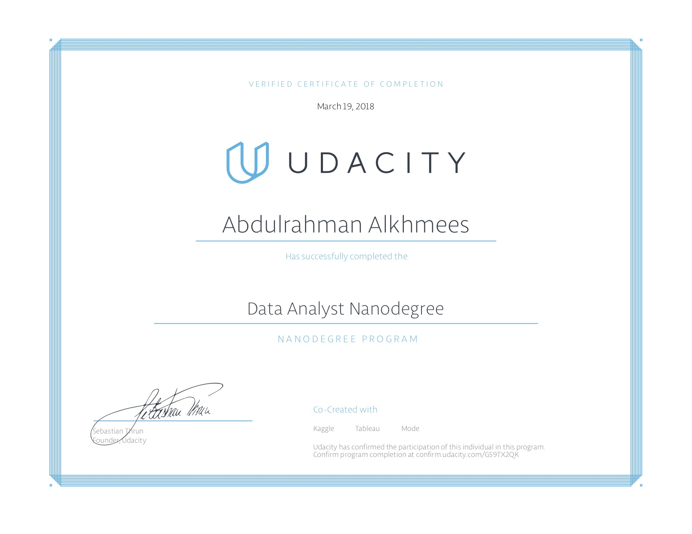

## Projects
[Kickstarter Exploratory Data Analysis:](iKickstarter_Exploratory_Data_Analysis.html) In this project, we will use **R** and apply exploratory data analysis techniques to explore relationships in one variable to multiple variables and to explore a selected data set for distributions, outliers, and anomalies. The dataset for this project is coming from Kickstarter, an American public-benefit corporation based in Brooklyn, New York, that maintains a global crowdfunding platform focused on creativity. 

[Analyzing The Stroop Effect:](Analyzing_the_Stroop_Effect.html) In this project, we will investigate a classic phenomenon from experimental psychology called the Stroop Effect. We will learn a little bit about the experiment, create a hypothesis regarding the outcome of the task, then go through the task ourselves

[TMDB Movie Data:](TMDB_Movie_Dataset_Investigation.html) In this project, we'll go through the data analysis process by exploring the dataset contains information about 10,000 movies collected from The Movie Database (TMDb), including user ratings and revenue. We will use the Python libraries NumPy, Pandas, and Matplotlib. The goal of this project is to experience all the steps involved in a typical data analysis process.

[Explore US Bike Share Data:](US_Bike_Share_Activity_Analysis.html) In this project, we will make use of **Python** to explore data related to bike share systems for three major bike share systems in the United States. We will perform data wrangling to unify the format of data from the three systems and write code to compute descriptive statistics. We will also make use of a package that is not part of the standard Python library to help you visualize the data.

## Why I’ve taken this Nanodegree?
In a previous life, I used to deal with petabytes of data every day. My main job was to make sure that I optimize an infrastructure of multi-petabyte file-systems that are mainly used for genome sequencing and reservoir simulation. However, I didn’t have insight into what was going on at the application level and what kinds of questions the user was trying to answer. As a result, I wanted to learn more about what it takes to be data analyst and acquire a skill that would potentially be the PowerPoint of the 21st century.

## How much time did it take you to complete the Nanodegree?
It took me around 180 hours to finish the program. The following figures explain the distribution of the time.

## Would you get a certificate upon graduating from the program?
Yes :)

